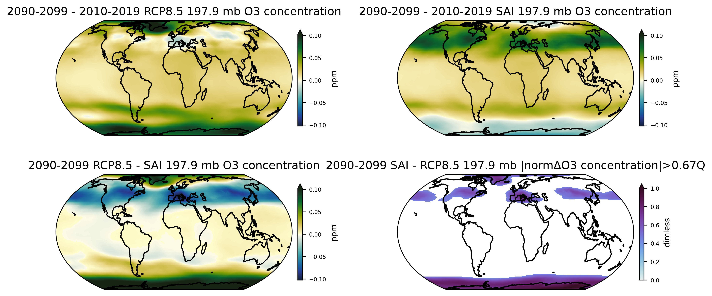
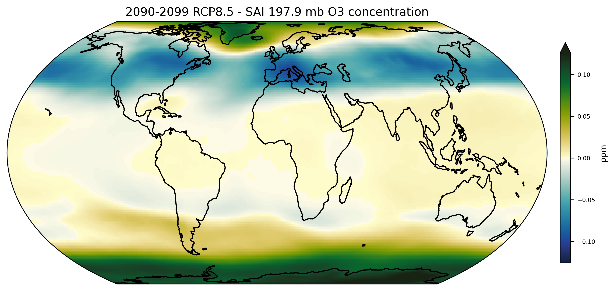
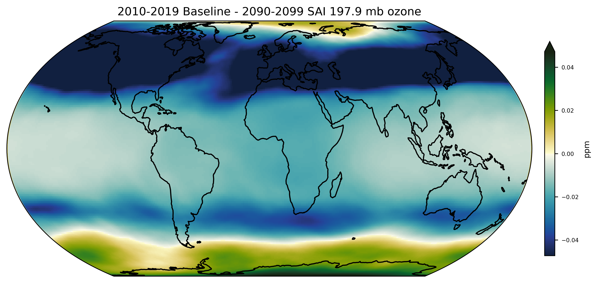
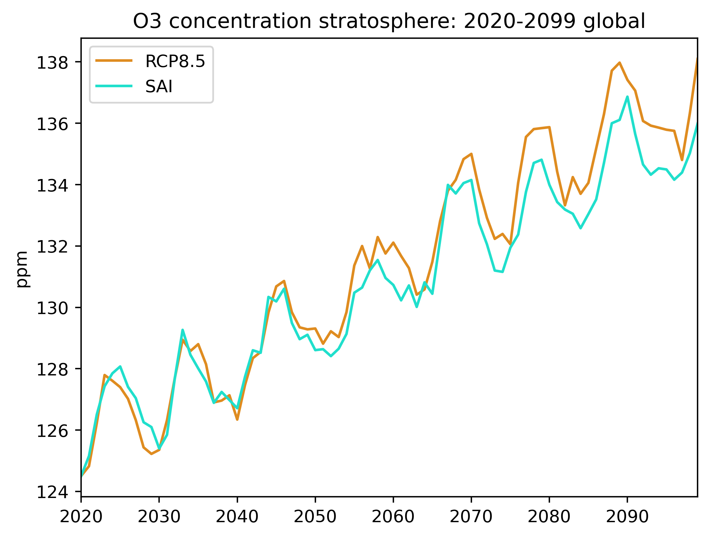
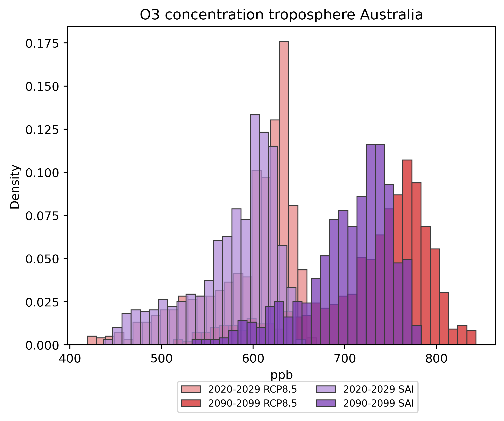
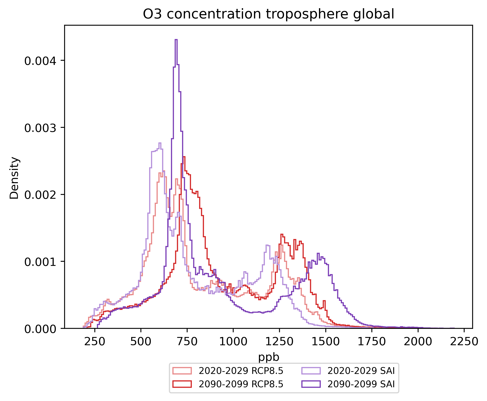

# GLENS
Repository for code analyzing stratospheric aerosol injection model output. This code is designed to work with output from the [Geoengineering Large ENSemble (GLENS)](https://www.cesm.ucar.edu/projects/community-projects/GLENS/). However, the medium-term intention is that it will apply to output from the [upcoming NCAR model runs performed under the Safe Climate Research Initiative](https://federallabs.org/news/ncar-noaa-lead-efforts-to-understand-risks-and-benefits-of-solar-geoenginering) with minor tuning.

## Example plots
There are three plots which are fundamental to this repository: difference globes, timeseries, and probability density functions (pdfs).

### Difference globes
These are standard "variable on a map" plots. They come in both 4-panel versions (`plot_difference_globe_script`) and 1-panel versions (`plot_single_difference_globe`). The basic 4-panel plot has the change over century for RCP8.5 on top left, SAI on the top right, final decade difference between RCP8.5 and SAI on bottom left, and a normalized metric showing where the greatest third of the changes occur.

By default, the 1-panel globe shows the end of century difference between RCP8.5 and SAI. This is the same as the lower left panel in the default 4-panel difference globe.

It's also easy to change this to show the change from the 2010-2019 ("Baseline") period from the RCP8.5 branch of GLENS.

### Timeseries
Timeseries show the change over time for a variable for both the RCP8.5 and SAI scenarios.

### Pdfs
Pdfs show the change over time for the probability density function of a variable for both the RCP8.5 and SAI scenarios. Three kinds of plots are available for visualizing the pdfs: histograms, kernel density estimates, and step plots.

Histograms show the data with the least amount of fuss. However, they can be hard to interpret when the pdfs overlap extensively.

Kernel density estimates produce the smoothest, most aesthetically-pleasing plots of the pdfs. They must be used carefully--smoothing the distribution can introduce the appearance of false data. This is particularly problematic for variables where a single value or threshold is physically meaningful, for example, sea surface temperature or air temperature.

Step plots plot a histogram without filling or edges. They are very useful when plotting a large amount of data where the distributions overlap heavily.

## Code description

### Data preprocessing
`casper_starter`: Contains the generic header and export command required for all jobs run on Casper or Cheyenne.  
`do_cdo_prep`: Merges GLENS monthly netcdf files, apply time shift, and calculates annual mean fields.  
`run_cdo_prep`: Runs `do_cdo_prep` on a set of control and feedback data files. (Submit using `qsub` on Casper/Cheyenne.)  
`run_untar_prep`: Untars a set of control and feedback files and moves to scratch directory. (Submit using `qsub` on Casper/Cheyenne.)

### Analysis and plotting
#### "Bread and butter"
`plot_difference_globe_script`: Plots differences for GLENS output variable on a 4-panel globe  
`plot_single_difference_globe_script`: Plots differences for GLENS variable on a single globe  
`plot_timeseries_script`: Plots timeseries from GLENS output  
`plot_pdf_script`: Plots pdfs (kde, histogram, or step plots)

### Other

#### Helpers
`difference_over_time`: module for calculating values related to changes over time  
`fun_convert_unit`: module for unit conversions  
`plotting_tools`: module for plotting GLENS output  
`process_glens_fun`: module for processing GLENS output (summing levels, etc.)  
`region_library`: Contains lat/lon bounds and other info for a variety of useful regions in easily-callable format.  
`run_test_script`: This is the coding equivalent of scratch paper.

#### Legacy
`plot_decadalpdf_script_libbyformat_ensmn`: legacy kept for method of ensemble means  
`prep_files_script`: uses Python-based CDO to prepare files, kept in case of offline processing

## Sources and Credit
Unless specified otherwise, all code and documentation was written by Daniel Hueholt as a Graduate Research Assistant advised by Profs. [Elizabeth Barnes](https://barnes.atmos.colostate.edu/) and [James Hurrell](https://sites.google.com/rams.colostate.edu/hurrellgroup/home) at [Colorado State University](https://www.colostate.edu/).
