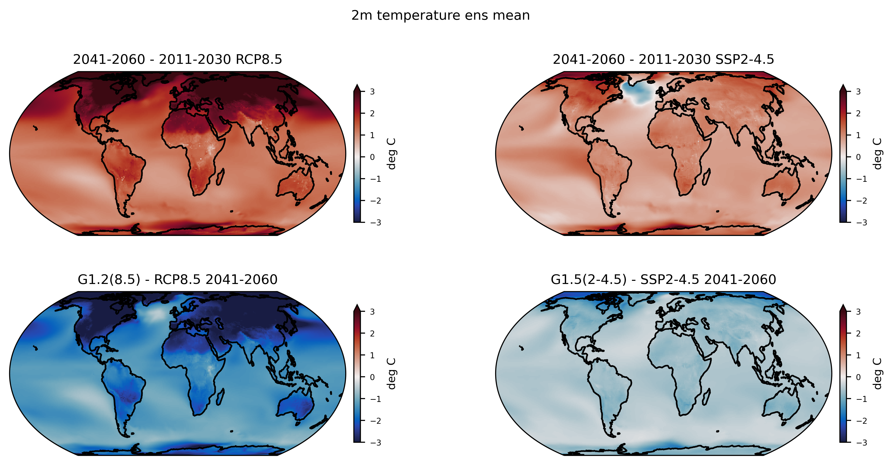
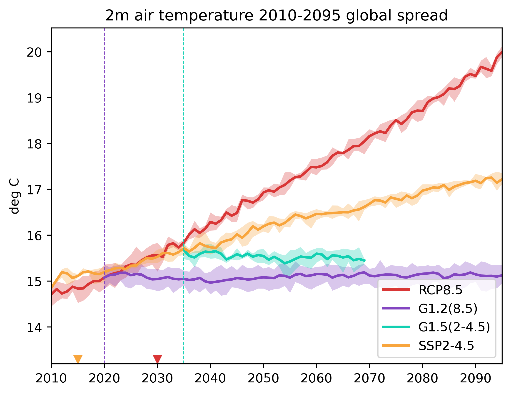
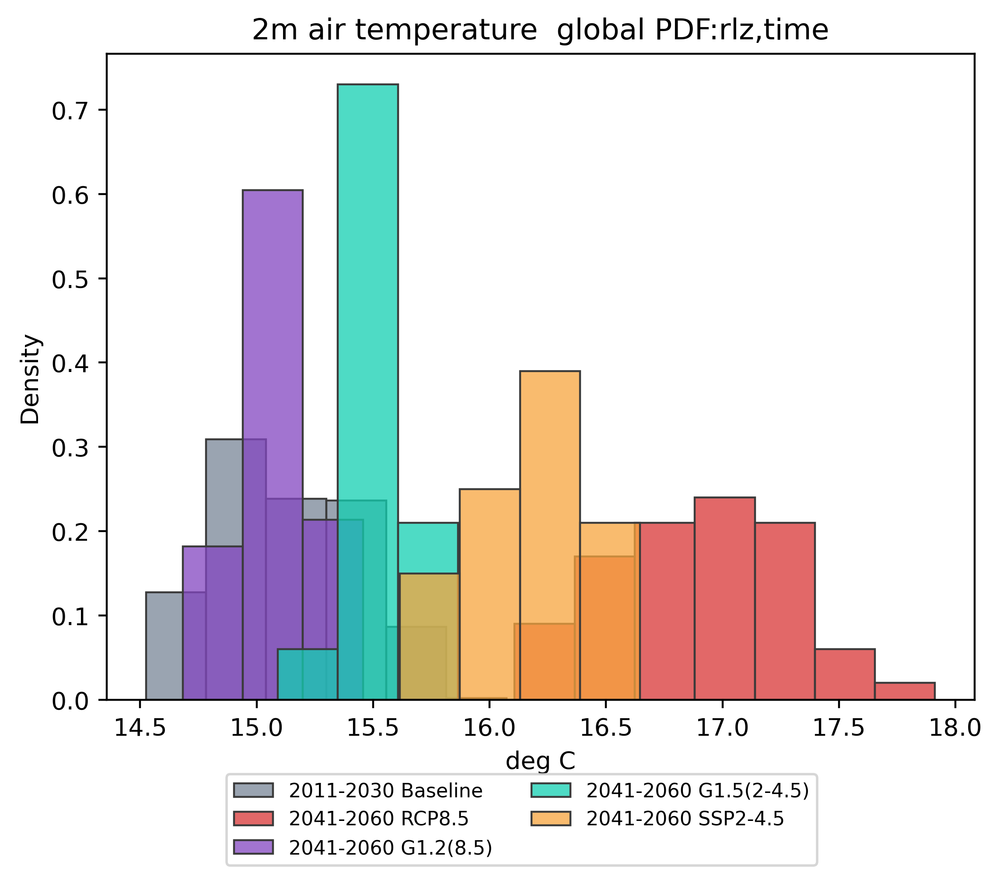
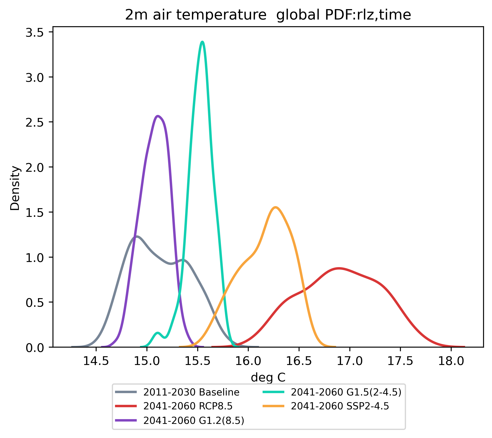
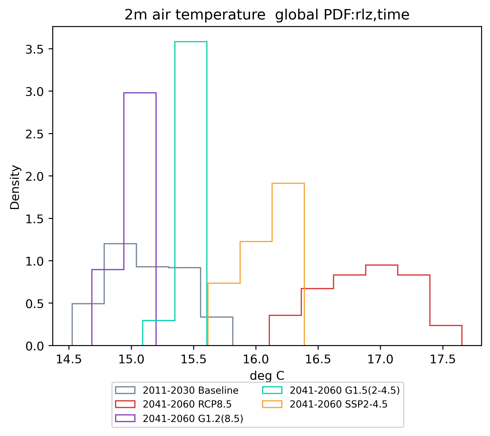

# SAI-CESM
Repository for code analyzing stratospheric aerosol injection model (SAI) output utilizing the Community Earth System Model (CESM). This code utilizes output from the following modeling experiments: 
1. [Geoengineering Large ENSemble (GLENS)](https://www.cesm.ucar.edu/projects/community-projects/GLENS/), consisting of 21 RCP8.5 Control runs and 21 G1.2(8.5) Feedback runs where SAI is used to target 1.2 Celsius above preindustrial against the RCP8.5 forcing
2. [Assessment of Responses and Impacts of Solar Climate Intervention on the Earth System (ARISE)](https://www.cesm.ucar.edu/projects/community-projects/ARISE-SAI/), consisting of 10 G1.5(2-4.5) runs where SAI is used to target 1.5 Celsius above preindustrial with a SSP2-4.5 scenario
3. CMIP6 CESM2-WACCM SSP2-4.5, which functions as the ARISE control with 5 members spanning 2015-2100
4. CESM2-WACCM Historical, which extends the ARISE control back in time to 1850

While this code is targeted at these specific SAI-related model runs, it can be modified to work with other CESM output.

## Example plots
There are three plots which are fundamental to this repository: difference globes, timeseries, and probability density functions (pdfs). These figures are made using `wrap_basicplots_script` and `wrap_ensplots_script`.
### Four-panel difference globe example

### Timeseries example

### pdfs
Three kinds of pdf figure are possible: histograms, kernel density estimates, and step plots.

## Sources and Credit
Unless specified otherwise, all code and documentation was written by Daniel Hueholt as a Graduate Research Assistant advised by Profs. [Elizabeth Barnes](https://barnes.atmos.colostate.edu/) and [James Hurrell](https://sites.google.com/rams.colostate.edu/hurrellgroup/home) at [Colorado State University](https://www.colostate.edu/).
